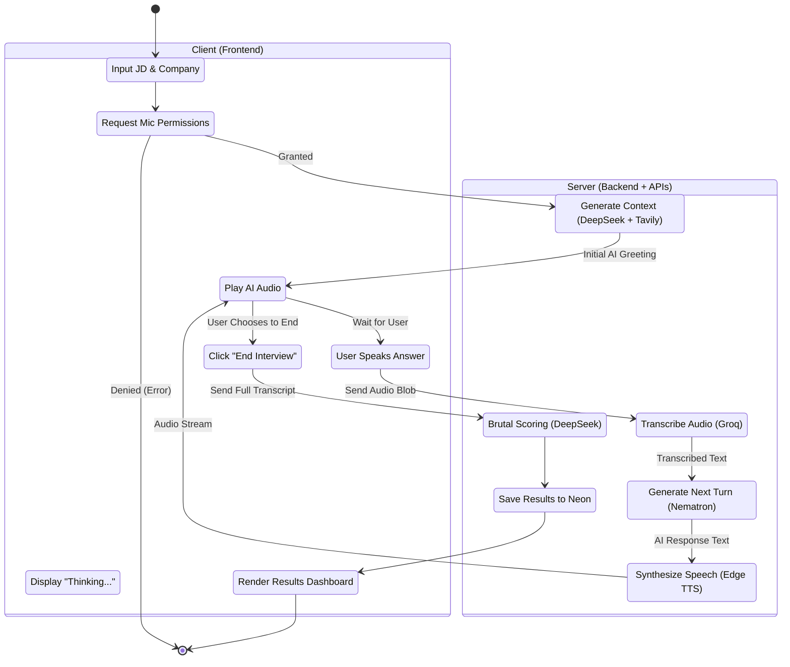

# Activity Diagram

## 1. Purpose
The Activity Diagram models the control flow of the primary business process: A student starting, conducting, and completing a mock interview. It highlights the conditional logic (e.g., waiting for mic access, handling API errors).

## 2. Assumptions
- The user is already logged in and has uploaded a resume.
- The diagram utilizes swimlanes to distinguish between Client (Frontend) and Server (Backend) responsibilities.

## 3. Mermaid Diagram

