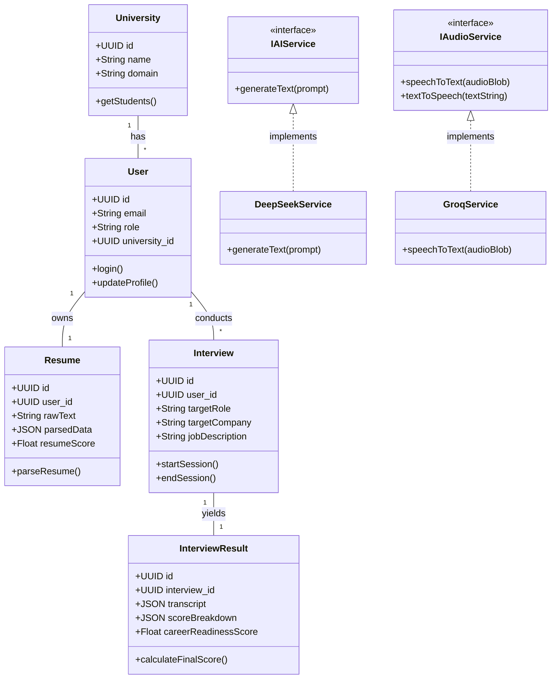

# Class Diagram

## 1. Purpose
The Class Diagram models the static structure of the CareerPilot backend application, outlining the primary objects, their attributes, methods, and relationships. It is particularly relevant for the Object-Oriented design of the ORM (SQLAlchemy/SQLModel) models and the service controllers.

## 2. Assumptions
- External AI clients are modeled as Interface implementations to demonstrate the Dependency Injection pattern (allowing easy swapping of providers).

## 3. Mermaid Diagram

