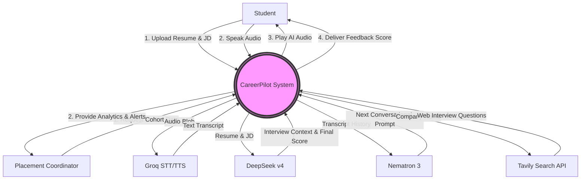

# Context Diagram

## 1. Purpose
The Context Diagram (also known as Level 0 DFD in some notations, though kept distinct here) provides a high-level, "black-box" view of the CareerPilot system. It illustrates the central system and its interactions with external entities (users and external APIs).

## 2. Assumptions
- The system abstracts the internal complexity of the modular backend.
- External APIs (Groq, DeepSeek, Nematron, Tavily) are treated as distinct external entities providing specific services.
- The University Administration acts as a distinct user archetype from the Student.

## 3. Explanation of Elements
- **CareerPilot System (Center):** The core application providing mock interview services.
- **Student (External Entity):** Inputs audio, JDs, and resumes; receives audio and feedback scores.
- **Placement Coordinator (External Entity):** Inputs queries; receives aggregated reports and alerts.
- **AI Providers (External Entities):** Groq provides STT; DeepSeek provides intelligence/scoring; Nematron provides conversational generation; Tavily provides web search context.

## 4. Mermaid Diagram

