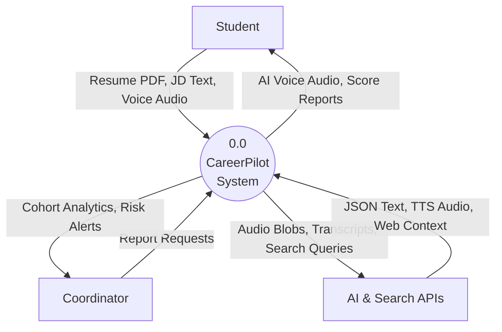

# Data Flow Diagram (Level 0)

## 1. Purpose
The Level 0 DFD (Context Diagram) establishes the system boundary. It identifies the external entities that interact with the system and the major data flows between them.

## 2. Assumptions
- The "System" is treated as a single process node (Process 0).
- Data flows are high-level groupings of information (e.g., "Student Data" implies Audio, Text, Resumes).

## 3. Explanation of Elements
- **Circle (Process 0):** The entire CareerPilot platform.
- **Rectangles (External Entities):** The Student, Placement Coordinator, and external AI APIs.
- **Arrows (Data Flows):** Represent the movement of data payloads.

## 4. Mermaid Diagram

