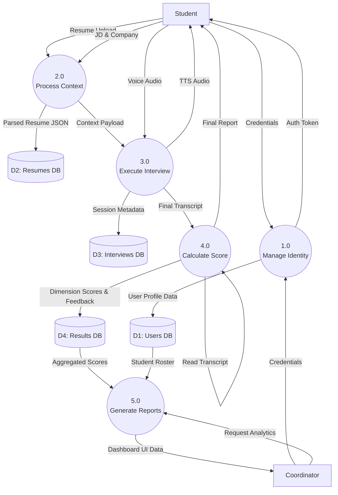

# Data Flow Diagram (Level 1)

## 1. Purpose
The Level 1 DFD breaks down Process 0 (CareerPilot System) into its major sub-processes, showing how data moves between the core functional modules and the primary datastores (Neon PostgreSQL).

## 2. Assumptions
- Datastores map roughly to the core database tables defined in the ER diagram.
- The external AI APIs are abstracted to avoid cluttering the primary business logic flow.

## 3. Explanation of Elements
- **Processes (Circles):** 
  - `1.0 Manage Identity`: Handles Auth and RBAC.
  - `2.0 Process Context`: Handles Resume parsing and JD search context.
  - `3.0 Execute Interview`: The live audio loop.
  - `4.0 Calculate Score`: Post-interview evaluation.
  - `5.0 Generate Reports`: Aggregation for the dashboard.
- **Datastores (Open Rectangles):** `D1 Users`, `D2 Resumes`, `D3 Interviews`, `D4 Results`.
- **Data Flows (Arrows):** Indicate the specific payloads moving between sub-processes and stores.

## 4. Mermaid Diagram

