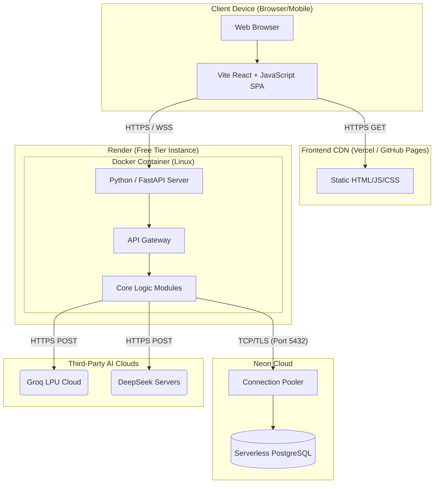

# Deployment Diagram

## 1. Purpose
The Deployment Diagram shows the physical mapping of software components to hardware/cloud infrastructure. It highlights the use of free-tier cloud environments for the MVP.

## 2. Assumptions
- Render provides HTTPS termination automatically.
- Vercel/GitHub Pages is used for the static frontend hosting via a global CDN.

## 3. Mermaid Diagram

```mermaid
architecture-beta
    %% Currently, Mermaid Architecture diagrams are highly experimental.
    %% Using a deployment graph syntax instead for reliability.
```
*Wait, `architecture-beta` might not render correctly in all standard markdown viewers. We will use a standard graph TD with subgraphs to map physical nodes.*


