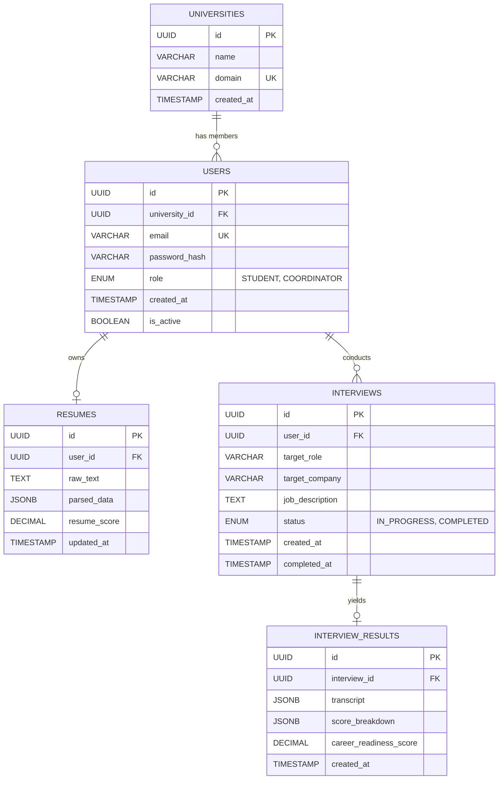

# Entity Relationship (ER) Diagram

## 1. Purpose
This diagram visualizes the relational schema of the Neon PostgreSQL database, outlining tables, primary keys, foreign keys, and multiplicity.

## 2. Mermaid Diagram

