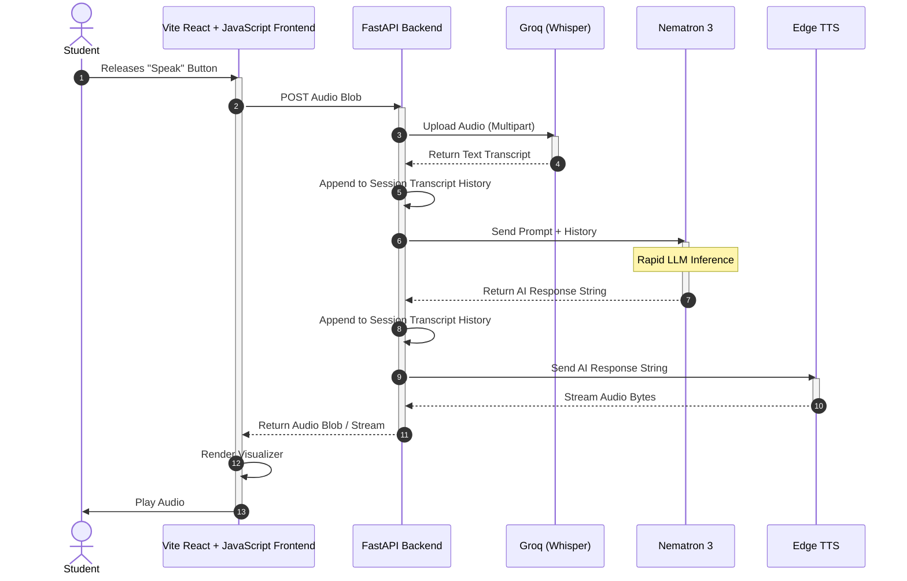

# Sequence Diagram

## 1. Purpose
The Sequence Diagram illustrates the exact chronological order of messages exchanged between the objects/components during the Live Audio Loop of the mock interview. It is critical for understanding the latency SLA.

## 2. Assumptions
- The WebSocket connection (or HTTP polling mechanism) is already established.
- The context has already been generated.
- The diagram shows a single conversational round trip.

## 3. Mermaid Diagram

