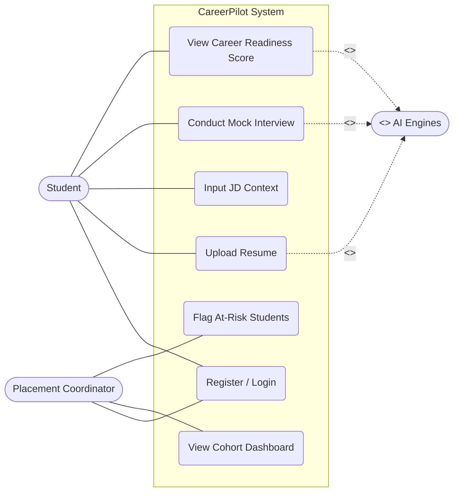

# Use Case Diagram

## 1. Purpose
The Use Case Diagram defines the functional scope of the CareerPilot platform from the perspective of its primary actors (Student, Placement Coordinator, and External AI Services). It maps out *what* the system does without detailing *how* it does it.

## 2. Assumptions
- Students must be authenticated to perform any action other than viewing the landing page.
- "Conduct Mock Interview" `<<includes>>` sub-cases like "Capture Audio" and "Generate AI Response".
- The AI Services act as secondary actors that respond to system triggers.

## 3. Explanation of Elements
- **Actors:**
  - **Student:** Primary actor interacting with the interview loop.
  - **Placement Coordinator:** Primary actor interacting with analytics.
  - **AI Engines (Secondary Actor):** Groups the external API services that process data.
- **Use Cases:** The oval nodes represent specific actions (e.g., Upload Resume, View Score).
- **Includes/Extends:** Denotes mandatory (`<<include>>`) sub-processes and optional (`<<extend>>`) variations.

## 4. Mermaid Diagram

```mermaid
usecaseDiagram
    actor Student
    actor Coordinator as "Placement Coordinator"
    actor AIEngines as "<<System>>\nAI Engines"

    rectangle "CareerPilot System" {
        usecase "Register/Login" as UC1
        usecase "Upload Resume" as UC2
        usecase "Input JD Context" as UC3
        
        usecase "Conduct Mock Interview" as UC4
        usecase "Capture Audio" as UC4a
        usecase "Generate AI Audio Response" as UC4b
        
        usecase "View Career Readiness Score" as UC5
        usecase "Generate Score Breakdown" as UC5a
        
        usecase "View Cohort Dashboard" as UC6
        usecase "Identify At-Risk Students" as UC7
    }

    Student --> UC1
    Student --> UC2
    Student --> UC3
    Student --> UC4
    Student --> UC5
    
    Coordinator --> UC1
    Coordinator --> UC6
    Coordinator --> UC7
    
    %% Includes
    UC4 ..> UC4a : <<include>>
    UC4 ..> UC4b : <<include>>
    UC5 ..> UC5a : <<include>>

    %% AI Engine Interactions
    UC2 <-- AIEngines : Parses text
    UC4b <-- AIEngines : Transcribes & Generates
    UC5a <-- AIEngines : Calculates Score
```
*(Note: standard Mermaid does not natively support `usecaseDiagram` syntax identically to standard UML, so it is often rendered using flowcharts or specialized plugins. Below is the valid Mermaid Flowchart equivalent tailored to look like a Use Case diagram.)*


